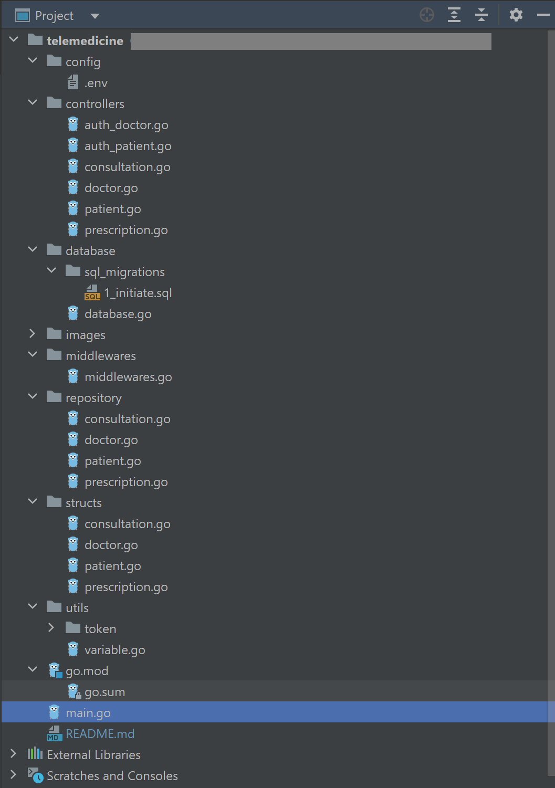
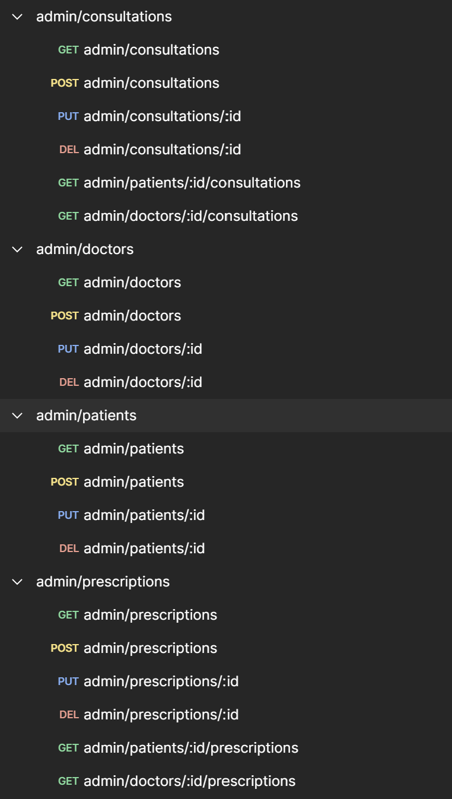
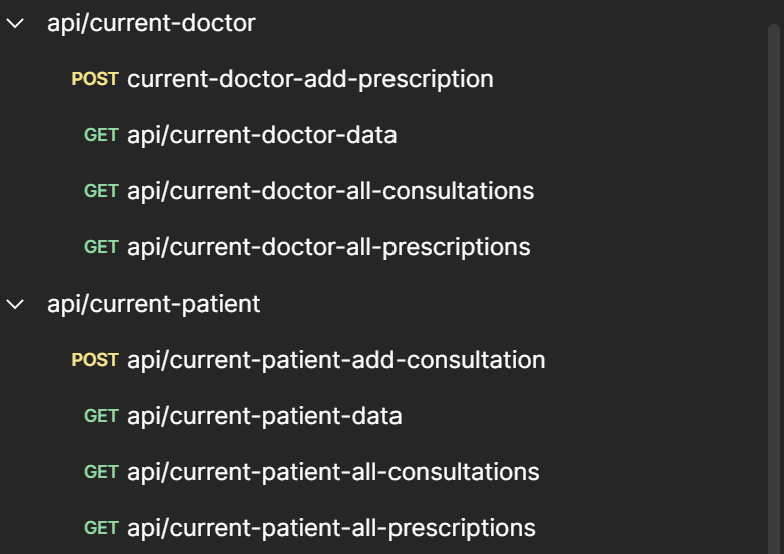
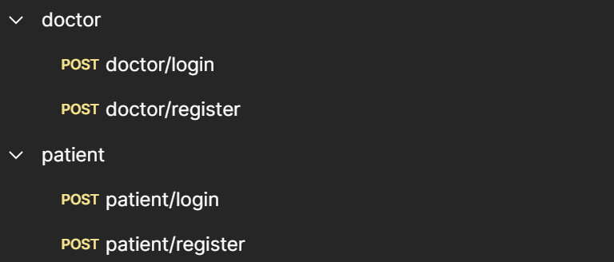

# SANBER-TELEMEDICINE

Final Project Golang - Backend Development
Peserta: Amanatulhay
Batch: 56

# ERD

# PROJECT STRUCTURE

# DEPLOYMENT DAN PATHS

Domain Railway = https://telemedicine-production.up.railway.app/

## ENDPOINT ADMIN

Dapat diakses dengan Basic Auth

## ENDPOINT API

Dapat diakses dengan Token menggunakan JWT Middleware setelah berhasil log in

## ENDPOINT PUBLIC

Tidak perlu Authorization apapun

